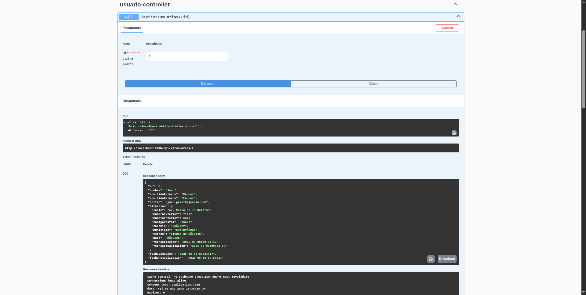

## 📚 Índice

| Índice                                                                   | 
|--------------------------------------------------------------------------|
| [⚙️ Requisitos previos](#-requisitos-previos)                            |
| [🔐 Aplication Properties](#-application-properties)                     |
| [🐳 Despliegue **rápido** con Docker](#-despliegue-rápido-con-docker)    |
| [🖥️ Despliegue **manual** (sin Docker)](#-despliegue-manual-sin-docker) |
| [📖 Visualizar actuadores](#-visualizar-actuadores)                   |
| [📸 Pantallas del funcionamiento](#-pantallas-del-funcionamiento)         |

---

### ⚙️ Requisitos previos
| Herramienta | Versión mínima | Notas                         |
|-------------|----------------|-------------------------------|
| **OS**       | Linux          | Debian GNU/Linux 12 (bookworm) |
| **Java**    | 21             | Virtual Thread 21             |
| **Maven**   | 3.9            | Wrapper `./mvnw` incluido     |
| **MySQL**   | 8.4.6          | Sólo en despliegue manual     |
| **Docker**  | 28.3.3 Community | Opcional                      |

---

### 🔐 Application properties

| Propiedad | Descripción | Ejemplo / Valor |
|-----------|-------------|-----------------|
| `copomex.token` | **Token personal** para consumir el API de COPOMEX. | `e06e2db6-982a-…` |
| `copomex.base-url` | URL base del servicio COPOMEX. | `https://api.copomex.com` |
| `spring.datasource.url` | Cadena JDBC hacia MySQL. | `jdbc:mysql://localhost:3306/lacomer_usuarios` |
| `spring.datasource.username` | Usuario con permisos sobre la BD. | `root` |
| `spring.datasource.password` | Contraseña de dicho usuario. | `lacomerroot` |
| `spring.jpa.hibernate.ddl-auto` | Estrategia de creación de esquema. | `none` (solo scripts) |
| `server.port` | Puerto HTTP donde corre la app. | `8080` |
| `management.endpoints.web.base-path` | Prefijo para endpoints Actuator. | `/secret` |
| `spring.security.user.*` | Credenciales básicas para `/secret/**`. | `monitor / monitor` |

---

## 🐳 Despliegue **rápido** con Docker

```bash
git clone git@github.com:David-Carr-C/lacomerexamentecnico.git
cd lacomerexamentecnico
docker compose up -d --build
```

## 🖥️ Despliegue **manual** (sin Docker)
1. Clonar el repositorio
2. Instalar MySQL 8.4.6
3. Instalar Java 21 y Maven 3.8.7
2. Instalar las dependencias:
   ```bash
   mvn clean install
   ```
3. Importar la base de datos
```
mysql -u root -p < src/main/resources/db/script.sql
```
3. Complicación del proyecto:
   ```bash
   mvn clean package -DskipTests
   ```
4. Ejecutar la aplicación:
```bash
  java -jar target/LaComerExamenTecnico-0.0.1-SNAPSHOT.jar 
```
4. Abrir el navegador y acceder a:
   - http://localhost:8080/swagger-ui/index.html

## 📖 Visualizar actuadores
Para visualizar los actuadores, puedes acceder a:
- http://localhost:8080/secret
Con las credenciales:
- Usuario: `monitor`
- Contraseña: `monitor`

## 📸 Documentación de la API
Estas ligas deben estar bajo el rol administrador,
por fines de desarrollo y pruebas se encuentra abierta
(Cambiar en la SecurityConfig.java):
- http://localhost:8080/swagger-ui/index.html

Si quieres importarlo en Postman, 
puedes usar el siguiente enlace:
- http://localhost:8080/v3/api-docs

## 📸 Pantallas del funcionamiento
### Obtener Usuarios:


### Obtener Usuario por ID:


### Eliminar Usuario:


### Crear Usuario:


### Actualizar Usuario:
